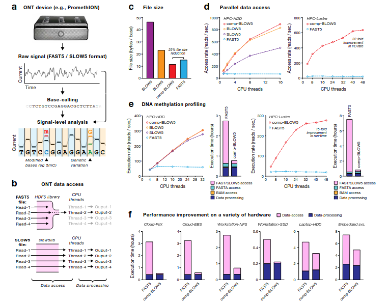

  `vmstat` - info about mem,cpu,io,swap
  
ctl-p ctl-q to detach run -it container :D
docker attach container_id to reattach

1. ~~make room in root&big data ~~
2. ~~find out WHY did this memory-shortage happened~~ - **logs**
3. ~~prevent this from happening again~~ - `docker run --log-driver none <image>`
czy problem z pamiecia na rootcie byl taki sam jak na big data? -> ten na roocie to logi `syslog`a

4. ~~czy eventalign ma prawo byc tak duzy?~~ (+17G - fast5 have ~43G)  `du -h`
5. ~~create documentation of eventalign output~~
6. napisz pre-processing script :D

7. what tech for NAS? (nfs for now)


`docker run -it --rm --name covid1 -v "$PWD":/media/twardovsky/sda/Mateusz_Kurzyński --log-driver none ca64a695154d bash`

`cd nanopolish`

`./nanopolish eventalign --reads /media/twardovsky/sda/Mateusz_Kurzyński/covid1/covid1.fq --bam /media/twardovsky/sda/Mateusz_Kurzyński/covid1/covid1.bam --genome /media/twardovsky/sda/Mateusz_Kurzyński/ref.fa --scale-events --signal-index --summary /media/twardovsky/sda/Mateusz_Kurzyński/covid1/final_summary.txt -t 30 > /media/twardovsky/sda/Mateusz_Kurzyński/covid1/eventalign.txt`
	uwzglednij polskie znaki, inaczej przez ssh nie pojdzie (ciekawe czemu -.-)

### docker
it creates MEGA SPECIFIC `json.log` files - they eat up storage ridiculusly fast
`docker run --log-driver none <image>` - supress docker logs creation for given container
OR
`docker run --log-driver syslog <image>` - for `syslog` (you can also use `journald`) logging driver

APPEND `--rm` - otherwise it get's messy (in `docker ps -a`) fast 

`docker container prune` - delete all stopped containers
`docker rm -f $(docker ps -aq)` - delete all containers, including running
`docker rmi image_id image_id` - delete images

`docker stats` - cpu/mem of docker containers
`docker inspect my_container` - info about container configuration
`docker history --no-trunc my_image` - history of **image**, including commands used to create it

`-u $(whoami)` - append this flag for easy management of permissions
	won't work e.g. in case of opening privileged port
`docker rename old_name new_name`

by default containers limited only by kernel scheduler:
```
By default, a container has no resource constraints and can use as much of a given resource as the host’s kernel scheduler allows
```


### eventalign output
MinION detect events per 5-mers passing through.
That means 1024 combinations for ~40-70pA range
- normal distribution of 5-mers overlap BUT solution must respect overlaps between subsequent 5-mers
`eventalign` - takes in a set of nanopore reads aligned according to base sequence of reference sequence (what read is where in reference) and re-aligns the reads in event space (what read was infered from that signal)
```
contig                         position  reference_kmer  read_index  strand  event_index  event_level_mean  event_length  model_kmer  model_mean  model_stdv
gi|556503834|ref|NC_000913.3|  10000     ATTGC           1           c       27470        50.57             0.022         ATTGC       50.58       1.02
gi|556503834|ref|NC_000913.3|  10001     TTGCG           1           c       27471        52.31             0.023         TTGCG       51.68       0.73
gi|556503834|ref|NC_000913.3|  10001     TTGCG           1           c       27472        53.05             0.056         TTGCG       51.68       0.73
gi|556503834|ref|NC_000913.3|  10001     TTGCG           1           c       27473        54.56             0.011         TTGCG       51.68       0.73
gi|556503834|ref|NC_000913.3|  10002     TGCGC           1           c       27474        65.56             0.012         TGCGC       66.96       2.91
gi|556503834|ref|NC_000913.3|  10002     TGCGC           1           c       27475        69.97             0.071         TGCGC       66.96       2.91
gi|556503834|ref|NC_000913.3|  10004     GCGCT           1           c       27476        67.11             0.017         GCGCT       68.08       2.20
```
- output has one row for every event. If a reference 5-mer was skipped, there will be a gap in the output where no signal was observed
event 27470
	- had a measured current level of 50.57 pA
	- aligns to the reference 5-mer ATTGC at position 10,000 of the reference
	- pore model indicates that events measured for 5-mer ATTGC should come from N(50.58,1.022) -> matches the observed data very well
events 27471, 27472, 27473
	- all aligned to the same reference 5-mer (TTGCG) -> event detector erroneously called 3 events where only one should have been emitted
	- expected distribution N(51.68,0.732) -> not really accurate match


```
twardovsky@twardovsky:/media/twardovsky/sda/Mateusz_Kurzyński$ vmstat
procs -----------memory---------- ---swap-- -----io---- -system-- ------cpu-----
 r  b   swpd   free   buff  cache   si   so    bi    bo   in   cs us sy id wa st
 4  0  45824 39683144 6230036 400434528    0    0     4    31    0    0  5  4 91  0  0
twardovsky@twardovsky:/media/twardovsky/sda/Mateusz_Kurzyński$ docker stats --no-stream
CONTAINER ID   NAME              CPU %     MEM USAGE / LIMIT     MEM %     NET I/O       BLOCK I/O     PIDS
0237217916ea   epic_hugle        23.12%    1.734GiB / 440.8GiB   0.39%     986kB / 0B    3.61GB / 0B   2
89fe6a1f4c42   eloquent_carver   21.47%    2.041GiB / 440.8GiB   0.46%     987kB / 0B    3.28GB / 0B   2
b07ad26795d9   sleepy_boyd       0.00%     2.949MiB / 440.8GiB   0.00%     1.78MB / 0B   0B / 0B       1
```


./nanopolish eventalign --reads /media/twardovsky/sda/Mateusz_Kurzyński/covid1/covid1.fq --bam /media/twardovsky/sda/Mateusz_Kurzyński/covid1/covid1.bam --genome /media/twardovsky/sda/Mateusz_Kurzyński/ref.fa --scale-events --signal-index --summary /media/twardovsky/sda/Mateusz_Kurzyński/covid1/final_summary.txt -t 35 > /media/twardovsky/sda/Mateusz_Kurzyński/covid1/eventalign.txt

./nanopolish eventalign --reads /media/twardovsky/sda/Mateusz_Kurzyński/covid2/covid2.fq --bam /media/twardovsky/sda/Mateusz_Kurzyński/covid2/covid2.bam --genome /media/twardovsky/sda/Mateusz_Kurzyński/ref.fa --scale-events --signal-index --summary /media/twardovsky/sda/Mateusz_Kurzyński/covid2/final_summary.txt -t 35 > /media/twardovsky/sda/Mateusz_Kurzyński/covid2/eventalign.txt

./nanopolish eventalign --reads /media/twardovsky/sda/Mateusz_Kurzyński/patient11/patient11.fq --bam /media/twardovsky/sda/Mateusz_Kurzyński/patient11/patient11.bam --genome /media/twardovsky/sda/Mateusz_Kurzyński/ref.fa --scale-events --signal-index --summary /media/twardovsky/sda/Mateusz_Kurzyński/patient11/final_summary.txt -t 35 > /media/twardovsky/sda/Mateusz_Kurzyński/patient11/eventalign.txt

./nanopolish eventalign --reads /media/twardovsky/sda/Mateusz_Kurzyński/patient14/patient14.fq --bam /media/twardovsky/sda/Mateusz_Kurzyński/patient14/patient14.bam --genome /media/twardovsky/sda/Mateusz_Kurzyński/ref.fa --scale-events --signal-index --summary /media/twardovsky/sda/Mateusz_Kurzyński/patient14/final_summary.txt -t 15 > /media/twardovsky/sda/Mateusz_Kurzyński/patient14/eventalign.txt


- ok. 10% na ubiciu jednego
- docker stats:
	-t 35 -> 36 PIDS
	-t 100 -> 101 PIDS
	ALE oba ok 200%CPU + 200%containerd-shim (10% z 40cpu)
wyglada na to, ze to wina bibloteki HDF5 (z 1998r.) -inefficient data reading

[source](https://assets.researchsquare.com/files/rs-668517/v1_covered.pdf?c=1663272977)


- check [f5c](https://github.com/hasindu2008/f5c) for eventalign results (similar to nanopore? usefull for methylation with `m6anet`? better cpu usage?)


### ideas for better future
- Zainstaluj GPU [nvidia drivers](https://www.nvidia.com/Download/index.aspx), [nvidia runtime](https://nvidia.github.io/nvidia-container-runtime/)   ~~(GeForce GTX 750 Ti)~~
- TMUX


start tests when dorado is finished
[f5c](https://github.com/hasindu2008/f5c)
[fast5<->slow5](https://hasindu2008.github.io/slow5tools/)

patient14 as a guinea pig.
1. nanopolish with `--slow5` option, the subsequent commands like eventalign will use the corresponding `blow5` file you gave as input to the nanopolish index - APPEND with `touch endmark.txt` for estimation of execution time
2. `f5c` with the same configs as above + GPU (after dorado finish)


#### converting fast5->slow5

move fast5_fail to fast5_pass
`docker run -it --rm --name slow5tools -v "$PWD":/patient14 --log-driver none slow5tools bash`
`./scripts/install-vbz.sh` - install plugin for `hdf5` `VBS` compression
`export HDF5_PLUGIN_PATH=/root/.local/hdf5/lib/plugin` - export plugin to path
	**(add this 2 to Dockerfile and make a better Docker image)**
`./slow5tools f2s /patient14/fast5_pass/ -d /patient14/blow5_dir -p 10`
	`BLOW5` files (default compression: zlib+svb-zd)
	`-p` nr of I/O processes

`./slow5tools merge /patient14/blow5_dir -o /patient14/signals.blow5 -t15`
	merge into one file
	`-t` 8 threads

`./nanopolish index /media/twardovsky/sda/Mateusz_Kurzyński/patient14/patient14.fq --slow5 /media/twardovsky/sda/Mateusz_Kurzyński/patient14/signals.blow5`
	rest of the nanopolish commands should work without any special options


`./nanopolish eventalign --reads /media/twardovsky/sda/Mateusz_Kurzyński/patient14/patient14.fq --bam /media/twardovsky/sda/Mateusz_Kurzyński/patient14/patient14.bam --genome /media/twardovsky/sda/Mateusz_Kurzyński/ref.fa --scale-events --signal-index --summary /media/twardovsky/sda/Mateusz_Kurzyński/patient14/final_summary.txt -t 15 > /media/twardovsky/sda/Mateusz_Kurzyński/patient14/eventalign.txt` -> NOT faster :<


#### f5c
install through `docker` don't have official support of GPU
if I manage to make it work - I will help them:D

~~`docker run -it --rm --name f5c_patient14 -v "$PWD":/media/twardovsky/sda/Mateusz_Kurzyński --log-driver none f5c bash`~~ - problems with locale (brak "ń")

`f5c eventalign -r /media/twardovsky/sda/Mateusz_Kurzyński/patient14/patient14.fq -b /media/twardovsky/sda/Mateusz_Kurzyński/patient14/patient14.bam -g /media/twardovsky/sda/Mateusz_Kurzyński/ref.fa --slow5 /media/twardovsky/sda/Mateusz_Kurzyński/patient14/signals.blow5 --scale-events --signal-index --summary /media/twardovsky/sda/Mateusz_Kurzyński/patient14/final_summary.txt -t 15 --rna > /media/twardovsky/sda/Mateusz_Kurzyński/patient14/eventalign.txt`
	problem with "ń" via ssh
	na condzie - śmiga :D `conda create -n f5c -c bioconda -c conda-forge f5c`
	zuzycie == 15 watkom - geat success:DDD

- command dump of the rest:
move fast5_fail to pass

`docker run -it --rm --name slow5tools -v "$PWD":/data --log-driver none slow5tools bash`

`./scripts/install-vbz.sh` - install plugin for `hdf5` `VBS` compression
`export HDF5_PLUGIN_PATH=/root/.local/hdf5/lib/plugin` - export plugin to path
	**(add this 2 to Dockerfile and make a better Docker image)**

./slow5tools f2s /data/covid1/fast5_pass/ -d /data/covid1/blow5_dir -p 10;\
./slow5tools f2s /data/covid2/fast5_pass/ -d /data/covid2/blow5_dir -p 10;\
./slow5tools f2s /data/patient11/fast5_pass/ -d /data/patient11/blow5_dir -p 10;\
./slow5tools merge /data/covid1/blow5_dir -o /data/covid1/signals.blow5 -t35;\
./slow5tools merge /data/covid2/blow5_dir -o /data/covid2/signals.blow5 -t35;\
./slow5tools merge /data/patient11/blow5_dir -o /data/patient11/signals.blow5 -t35


- try to index with f5c index (the same as nanopolish so you don't really have to, but let's check!)

nohup f5c index --slow5 /media/twardovsky/sda/Mateusz_Kurzyński/covid1/signals.blow5 /media/twardovsky/sda/Mateusz_Kurzyński/covid1/covid1.fq 2> /media/twardovsky/sda/Mateusz_Kurzyński/covid1/error_index.txt;\
nohup f5c index --slow5 /media/twardovsky/sda/Mateusz_Kurzyński/covid2/signals.blow5 /media/twardovsky/sda/Mateusz_Kurzyński/covid2/covid2.fq 2> /media/twardovsky/sda/Mateusz_Kurzyński/covid2/error_index.txt;\
nohup f5c index --slow5 /media/twardovsky/sda/Mateusz_Kurzyński/patient11/signals.blow5 /media/twardovsky/sda/Mateusz_Kurzyński/patient11/patient11.fq 2> /media/twardovsky/sda/Mateusz_Kurzyński/patient11/error_index.txt;\
nohup f5c index --slow5 /media/twardovsky/sda/Mateusz_Kurzyński/patient14/signals.blow5 /media/twardovsky/sda/Mateusz_Kurzyński/patient14/patient14.fq 2> /media/twardovsky/sda/Mateusz_Kurzyński/patient14/error_index.txt
	works

nohup f5c eventalign -r /media/twardovsky/sda/Mateusz_Kurzyński/covid1/covid1.fq --bam /media/twardovsky/sda/Mateusz_Kurzyński/covid1/covid1.bam -g /media/twardovsky/sda/Mateusz_Kurzyński/ref.fa --slow5 /media/twardovsky/sda/Mateusz_Kurzyński/covid1/signals.blow5 --scale-events --signal-index --summary /media/twardovsky/sda/Mateusz_Kurzyński/covid1/final_summary.txt -t 35 --rna > /media/twardovsky/sda/Mateusz_Kurzyński/covid1/eventalign.txt 2> /media/twardovsky/sda/Mateusz_Kurzyński/covid1/error_eventalign.txt;\
\
nohup f5c eventalign -r /media/twardovsky/sda/Mateusz_Kurzyński/covid2/covid2.fq --bam /media/twardovsky/sda/Mateusz_Kurzyński/covid2/covid2.bam -g /media/twardovsky/sda/Mateusz_Kurzyński/ref.fa --slow5 /media/twardovsky/sda/Mateusz_Kurzyński/covid2/signals.blow5 --scale-events --signal-index --summary /media/twardovsky/sda/Mateusz_Kurzyński/covid2/final_summary.txt -t 35 --rna > /media/twardovsky/sda/Mateusz_Kurzyński/covid2/eventalign.txt 2> /media/twardovsky/sda/Mateusz_Kurzyński/covid2/error_eventalign.txt;\
\
nohup f5c eventalign -r /media/twardovsky/sda/Mateusz_Kurzyński/patient11/patient11.fq --bam /media/twardovsky/sda/Mateusz_Kurzyński/patient11/patient11.bam -g /media/twardovsky/sda/Mateusz_Kurzyński/ref.fa --slow5 /media/twardovsky/sda/Mateusz_Kurzyński/patient11/signals.blow5 --scale-events --signal-index --summary /media/twardovsky/sda/Mateusz_Kurzyński/patient11/final_summary.txt -t 35 --rna > /media/twardovsky/sda/Mateusz_Kurzyński/patient11/eventalign.txt 2> /media/twardovsky/sda/Mateusz_Kurzyński/patient11/error_eventalign.txt;\
\
nohup f5c eventalign -r /media/twardovsky/sda/Mateusz_Kurzyński/patient14/patient14.fq --bam /media/twardovsky/sda/Mateusz_Kurzyński/patient14/patient14.bam -g /media/twardovsky/sda/Mateusz_Kurzyński/ref.fa --slow5 /media/twardovsky/sda/Mateusz_Kurzyński/patient14/signals.blow5 --scale-events --signal-index --summary /media/twardovsky/sda/Mateusz_Kurzyński/patient14/final_summary.txt -t 35 --rna > /media/twardovsky/sda/Mateusz_Kurzyński/patient14/eventalign.txt 2> /media/twardovsky/sda/Mateusz_Kurzyński/patient14/error_eventalign.txt
	sukces^^


from doc:
``` shell
###### Using FAST5 as input ######

#index, call methylation and get methylation frequencies
f5c index -d chr22_meth_example/fast5_files chr22_meth_example/reads.fastq
f5c call-methylation -b chr22_meth_example/reads.sorted.bam -g chr22_meth_example/humangenome.fa -r chr22_meth_example/reads.fastq > chr22_meth_example/result.tsv
f5c meth-freq -i chr22_meth_example/result.tsv > chr22_meth_example/freq.tsv
#event alignment
f5c eventalign -b chr22_meth_example/reads.sorted.bam -g chr22_meth_example/humangenome.fa -r chr22_meth_example/reads.fastq > chr22_meth_example/events.tsv

###### Using SLOW5 as input ######

#index, call methylation and get methylation frequencies
f5c index --slow5 chr22_meth_example/reads.blow5 chr22_meth_example/reads.fastq
f5c call-methylation --slow5 chr22_meth_example/reads.blow5 -b chr22_meth_example/reads.sorted.bam -g chr22_meth_example/humangenome.fa -r chr22_meth_example/reads.fastq > chr22_meth_example/result.tsv
f5c meth-freq -i chr22_meth_example/result.tsv > chr22_meth_example/freq.tsv
#event alignment
f5c eventalign --slow5 chr22_meth_example/signals.blow5 -b chr22_meth_example/reads.sorted.bam -g chr22_meth_example/humangenome.fa -r chr22_meth_example/reads.fastq > chr22_meth_example/events.tsv
```


### m6anet

#### dataprep

docker run -it --rm --name m6anet -v "$PWD":/media/twardovsky/sda/Mateusz_Kurzyński --log-driver none bfdf303a5403 bash

nohup m6anet dataprep --eventalign /media/twardovsky/sda/Mateusz_Kurzyński/covid1/eventalign.txt --out_dir /media/twardovsky/sda/Mateusz_Kurzyński/covid1/m6anet_dataprep --n_processes 35 2> /media/twardovsky/sda/Mateusz_Kurzyński/covid1/error_dataprep;\
nohup m6anet dataprep --eventalign /media/twardovsky/sda/Mateusz_Kurzyński/covid2/eventalign.txt --out_dir /media/twardovsky/sda/Mateusz_Kurzyński/covid2/m6anet_dataprep --n_processes 35 2> /media/twardovsky/sda/Mateusz_Kurzyński/covid2/error_dataprep;\
nohup m6anet dataprep --eventalign /media/twardovsky/sda/Mateusz_Kurzyński/patient11/eventalign.txt --out_dir /media/twardovsky/sda/Mateusz_Kurzyński/patient11/m6anet_dataprep --n_processes 35 2> /media/twardovsky/sda/Mateusz_Kurzyński/patient11/error_dataprep;\
nohup m6anet dataprep --eventalign /media/twardovsky/sda/Mateusz_Kurzyński/patient14/eventalign.txt --out_dir /media/twardovsky/sda/Mateusz_Kurzyński/patient14/m6anet_dataprep --n_processes 35 2> /media/twardovsky/sda/Mateusz_Kurzyński/patient14/error_dataprep
	przemielilo i chyba jest ok:D


conda create -n m6anet2.0.1 -c bioconda -c conda-forge python==3.7.16 
	nope

<in m6anet container>
pip install --upgrade pip
pip install --upgrade m6anet
	error:/


TO DO::
1. docker history --no-trunc bfdf303a5403
	write a Dockerfile for new m6anet
2. try to run dataprep:')


##### I managed to install m6anet
via conda
If I recall correctly - update conda, install python3.8, use pip3 to install m6anet
	CAN'T FIND IN HISTORY:<

```
  File "/home/twardovsky/miniconda3/envs/m6anet2/bin/m6anet", line 8, in <module>
    sys.exit(main())
  File "/home/twardovsky/miniconda3/envs/m6anet2/lib/python3.8/site-packages/m6anet/__init__.py", line 30, in main
    args.func(args)
  File "/home/twardovsky/miniconda3/envs/m6anet2/lib/python3.8/site-packages/m6anet/scripts/dataprep.py", line 62, in main
    parallel_index(args.eventalign, args.chunk_size,
  File "/home/twardovsky/miniconda3/envs/m6anet2/lib/python3.8/site-packages/m6anet/utils/dataprep_utils.py", line 245, in parallel_index
    for chunk in pd.read_csv(eventalign_filepath, chunksize=chunk_size,sep='\t'):
  File "/home/twardovsky/miniconda3/envs/m6anet2/lib/python3.8/site-packages/pandas/io/parsers.py", line 1128, in __next__
    return self.get_chunk()
  File "/home/twardovsky/miniconda3/envs/m6anet2/lib/python3.8/site-packages/pandas/io/parsers.py", line 1188, in get_chunk
    return self.read(nrows=size)
  File "/home/twardovsky/miniconda3/envs/m6anet2/lib/python3.8/site-packages/pandas/io/parsers.py", line 1154, in read
    ret = self._engine.read(nrows)
  File "/home/twardovsky/miniconda3/envs/m6anet2/lib/python3.8/site-packages/pandas/io/parsers.py", line 2059, in read
    data = self._reader.read(nrows)
  File "pandas/_libs/parsers.pyx", line 881, in pandas._libs.parsers.TextReader.read
  File "pandas/_libs/parsers.pyx", line 908, in pandas._libs.parsers.TextReader._read_low_memory
  File "pandas/_libs/parsers.pyx", line 950, in pandas._libs.parsers.TextReader._read_rows
  File "pandas/_libs/parsers.pyx", line 937, in pandas._libs.parsers.TextReader._tokenize_rows
  File "pandas/_libs/parsers.pyx", line 2132, in pandas._libs.parsers.raise_parser_error
pandas.errors.ParserError: Error tokenizing data. C error: Expected 1 fields in line 5, saw 15
```
check:
/home/twardovsky/miniconda3/envs/m6anet2/lib/python3.8/site-packages/pandas/io/parsers.py

/home/twardovsky/miniconda3/envs/m6anet2/lib/python3.8/site-packages/m6anet/utils/dataprep_utils.py

/home/twardovsky/miniconda3/envs/m6anet2/lib/python3.8/site-packages/m6anet/scripts/dataprep.py


I KNOW !!!!!!!!!!!!!!!!!!!!!!!!!!!!!!
It's wrong `nohup` !!!
```
If  standard  input  is  a terminal, redirect it from an unreadable file.  If standard output is a terminal, append output to
       'nohup.out' if possible, '$HOME/nohup.out' otherwise.  
       
       If standard error is a terminal, redirect it to standard  output.  <----- !!!1!!!!!1
```
I was correct^^


#### infering methylations


nohup m6anet inference --input_dir /media/twardovsky/sda/Mateusz_Kurzyński/covid1/m6anet_dataprep --out_dir /media/twardovsky/sda/Mateusz_Kurzyński/covid1/m6anet_infer  --n_processes 4 --num_iterations 1000 2> /media/twardovsky/sda/Mateusz_Kurzyński/covid1/error_infer.txt


nohup m6anet inference --input_dir /media/twardovsky/sda/Mateusz_Kurzyński/covid2/m6anet_dataprep --out_dir /media/twardovsky/sda/Mateusz_Kurzyński/covid2/m6anet_infer  --n_processes 4 --num_iterations 1000 2> /media/twardovsky/sda/Mateusz_Kurzyński/covid2/error_infer.txt;\
nohup m6anet inference --input_dir /media/twardovsky/sda/Mateusz_Kurzyński/patient11/m6anet_dataprep --out_dir /media/twardovsky/sda/Mateusz_Kurzyński/patient11/m6anet_infer  --n_processes 4 --num_iterations 1000 2> /media/twardovsky/sda/Mateusz_Kurzyński/patient11/error_infer.txt;\
nohup m6anet inference --input_dir /media/twardovsky/sda/Mateusz_Kurzyński/patient14/m6anet_dataprep --out_dir /media/twardovsky/sda/Mateusz_Kurzyński/patient14/m6anet_infer  --n_processes 4 --num_iterations 1000 2> /media/twardovsky/sda/Mateusz_Kurzyński/patient14/error_infer.txt
	chyba dzialczy

```
w-r--r-- 1 twardovsky twardovsky  26M May  2 10:18 data.indiv_proba.csv
-rw-r--r-- 1 twardovsky twardovsky 322K May  2 10:18 data.site_proba.csv
```


### further analysis

`data.indiv_proba.csv` - probability of mod for **`each read`**
	-   `transcript_id`: The transcript id of the predicted position
	-   `transcript_position`: The transcript position of the predicted position
	-   `read_index`: The read identifier from nanopolish that corresponds to the actual `read_id` from nanopolish `summary.txt`
	- ---------------------------
	-   `probability_modified`: The probability that a given read is modified


`data.site_proba.csv` - probability of mod at each individual position for **`each transcript`**
	-   `transcript_id`: The transcript id of the predicted position
	-   `transcript_position`: The transcript position of the predicted position
	-   `n_reads`: The number of reads for that particular position 
	- ---------------------------
	-   `probability_modified`: The probability that a given site is modified     <---
		devs recommend a threshold of 0.9 to select m6A sites
	-   `kmer`: The 5-mer motif of a given site
	-   `mod_ratio`: The estimated percentage of reads in a given site that is modified


in covid1_site there is 0.997 probability of k-mer being modified (transcript position 737, infered from 24 reads)
BUT
in covid1_site transcript position 737 individual reads gives low probabilities of being modified.
dosc logiczne ze per read jest mniej pewny niz per kmer, ale czy nadaje sie takie prawddopodobienstwo do publikacji?