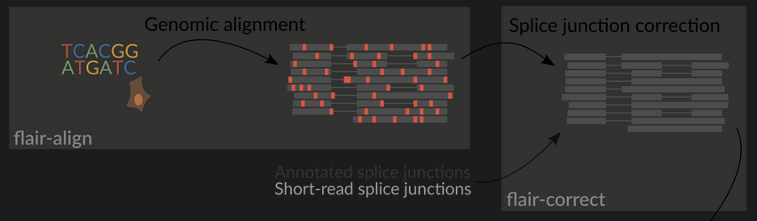
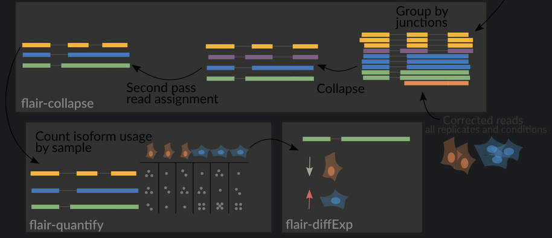

### install
`conda create -n flair -c conda-forge -c bioconda flair`
`conda activate flair`

`conda create -n bedops bedops` - for `convert2bed`

`cat genome.gtf | convert2bed --input=gtf > genome.bed` - for bed5 file dla `flair align`




### flair align
- reads to the genome using [minimap2](https://github.com/lh3/minimap2), and converts the [SAM](https://en.wikipedia.org/wiki/SAM_(file_format)) output to [BED12](https://genome.ucsc.edu/FAQ/FAQformat.html#format14)
- ligned reads in BED12 format can be visualized in [IGV](https://igv.org/) or the [UCSC Genome browser](https://genome.ucsc.edu/cgi-bin/hgGateway)

`flair align -g genome.fa -r <reads.fq>/<reads.fa> --nvrna --junction_bed file.bed --threads 4 --output covid1/`
	- `r` accpt comma/space separated files
	- `--nvrna` - for noisy nanopore direct RNA-seq
	- `--junction_bed`  bonus score if an aligned junction matches a junction in the annotation - needs `bed file` (5-column BED?)

output:
	-  `flair.aligned.bam`    
	-   `flair.aligned.bam.bai`
	-   `flair.aligned.bed` (bed12)


### flair correct
corrects misaligned splice sites using genome annotations and/or short-read splice junctions

`flair correct -q flair.aligned.bed --gtf annotation.gtf -g genome.fa --threads 4 --nvrna`
	`--nvrna` make strand of a read consistent with the input annotation
	`--ss_window`  window size for correcting splice sites (default 15) ???

output:
	-   `flair_all_corrected.bed` for use in subsequent steps
	-   `flair_all_inconsistent.bed` rejected alignments  
	-   `flair_cannot_verify.bed` (only if the) chromosome is not found in annotation




### flair collapse

- not yet capable of dealing with large (>1G) input bed files -> you might need to chop it by chromosomes (I hope not)

correct dla WSZYSTKICH PROB - ***scatuj wszytkie bedy***

`flair collapse -g genome.fa -q flair_all_corrected.bed -r cov1.fq cov2.fq pat1.fq --gtf file.gtf --threads 4 --generate_map`
	`--annotation_reliant`       " Specify transcript fasta that corresponds to transcripts
                    in the gtf to run annotation-reliant flair collapse; to ask flair
                    to make transcript sequences given the gtf and genome fa, use
                    --annotation_reliant generate"  ????
	`--output` name base for output files
		default: `flair.collapse`

output:
	-   `isoforms.bed`
	-   `isoforms.gtf`
	-   `isoforms.fa`


### flair quantify

how many isoforms per sample

`flair quantify -r reads_manifest.tsv -i isoforms.fa --threads 4 --sample_id_only`
	`-r` .tsv with:
		sample id, condition, batch, reads.fq
		where reads.fq is the path to the sample fastq file
		e.g:
```
sample1      condition1      batch1  mydata/sample1.fq
sample2      condition1      batch1  mydata/sample2.fq
sample3      condition1      batch1  mydata/sample3.fq
```
**DON'T USE UNDERSCORES** in first 3 fields
	`--sample_id_only` - use only sample id in output header
		instead of a concatenation of id, condition, and batch
	


TSSs/TESs - transcript start site, transcript end site